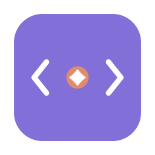

<div align="center">



# ClaudeWatch

**A macOS menu-bar history of the system-touching actions Claude Code and Codex run on your machine**

[](https://github.com/adamXbot/.github/blob/main/STATUS.md#claudewatch)
[](https://github.com/adamXbot/ClaudeWatch/actions/workflows/build.yml)
[](LICENSE)

</div>

<!-- disclosure:start -->
> [!WARNING]
> **Pre-1.0 — no stable release yet.** Anything can change in any release, including a patch: APIs, CLI flags, config keys, file formats, and data already on disk. Keep your own backups.
> **Project status.** The badge above is generated from [the adamXbot status list](https://github.com/adamXbot/.github/blob/main/STATUS.md), which says what I promise for this project and every other one.
<!-- disclosure:end -->

---

A lightweight menu-bar app that shows the latest system-touching actions
[Claude Code](https://claude.com/claude-code) and Codex perform on your machine — shell
commands, file writes and edits, and network fetches — so you can see at a glance what the
AI is actually doing.

Each entry links back to the thread that issued it: open the full conversation in your
browser (scrolled to the exact command), or resume that session in Claude Code or Codex.

It reads your local transcripts under `~/.claude/projects` and `~/.codex` and never writes
to them, and there is no telemetry. It is not fully offline, though: it embeds
[Sparkle](https://sparkle-project.org) for in-app updates, which polls an update feed, and
any webhook you configure sends notifications to the URL you give it.

## What it does

- **Watches every `*.jsonl` transcript** under `~/.claude/projects` (main sessions and
  nested subagent runs), plus Codex sessions under `~/.codex/sessions` and
  `~/.codex/archived_sessions`. It polls once a second and reads only newly-appended lines.
- **Turns each system-touching call into a row.** From Claude: `Bash` (the command plus its
  description), `Write` (path and size), `Edit` / `MultiEdit` (path), `NotebookEdit`
  (notebook and edit mode), `WebFetch` (URL), `WebSearch` (query). From Codex:
  `exec_command`, `write_stdin`, and `apply_patch`. Read-only tools (Read, Grep, Glob, Task
  and friends) are deliberately excluded — this is about what the AI *does*, not what it
  looks at.
- **Links each row to its source.** Click a row to render the whole thread to HTML and open
  it in your browser at that command; subagent rows open the subagent's own transcript.
  There are also buttons to open Terminal in the project and resume the session
  (`claude --resume` or `codex resume`), and to copy the command. Right-click for more —
  copy the session id, reveal the transcript file.
- **Tracks live sessions.** An "Active sessions" strip shows which sessions are working and
  which are waiting on you, and the menu-bar icon switches to a bell when one is waiting.
- **Notifies you on your own rules.** Rules can fire on a matching action or when a session
  finishes, scoped to all projects or a chosen set, and can go to a macOS notification or to
  a Discord, Slack, Microsoft Teams, or generic JSON webhook. Webhook URLs are stored in the
  Keychain rather than in preferences, because they often carry a token.
- **Filters what you see.** Search, per-kind and per-project toggles, a hide-subagents
  toggle, and a pause button.

One menu-bar item appears per source that has transcripts (Claude and Codex are tracked
separately), and you can force either one to always show or always hide in Settings. There
is no Dock icon.

## Get it

There is no packaged download yet — no release has been published, and there is no Homebrew
formula. For now, build it yourself. You need macOS 13 or later and a Swift 5.9 toolchain
(Xcode or the Command Line Tools).

```sh
git clone https://github.com/adamXbot/ClaudeWatch.git
cd ClaudeWatch
./build.sh            # produces ClaudeWatch.app, then opens it
```

Local builds are unsigned, so the first launch needs a right-click → Open, or an approval
under System Settings → Privacy & Security. To start it at login, add `ClaudeWatch.app`
under System Settings → General → Login Items.

"Resume in Claude Code" needs the `claude` CLI on your `PATH`, and the Codex equivalent
needs `codex`.

## Contributing

CI runs `swift build -c release`, `swift test`, and `./build.sh release` on macOS, on every
push to `main` and every pull request against it. Run the same locally before you open one:

```sh
swift test
./build.sh release
```

[CONTRIBUTING.md](CONTRIBUTING.md) covers the project layout, the headless inspection mode,
and the release job.

## Licence

MIT — see [LICENSE](LICENSE).
